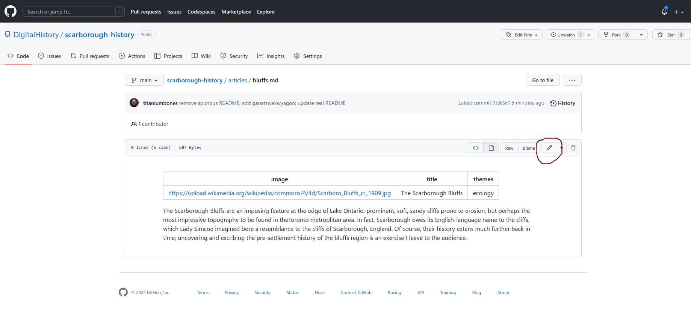
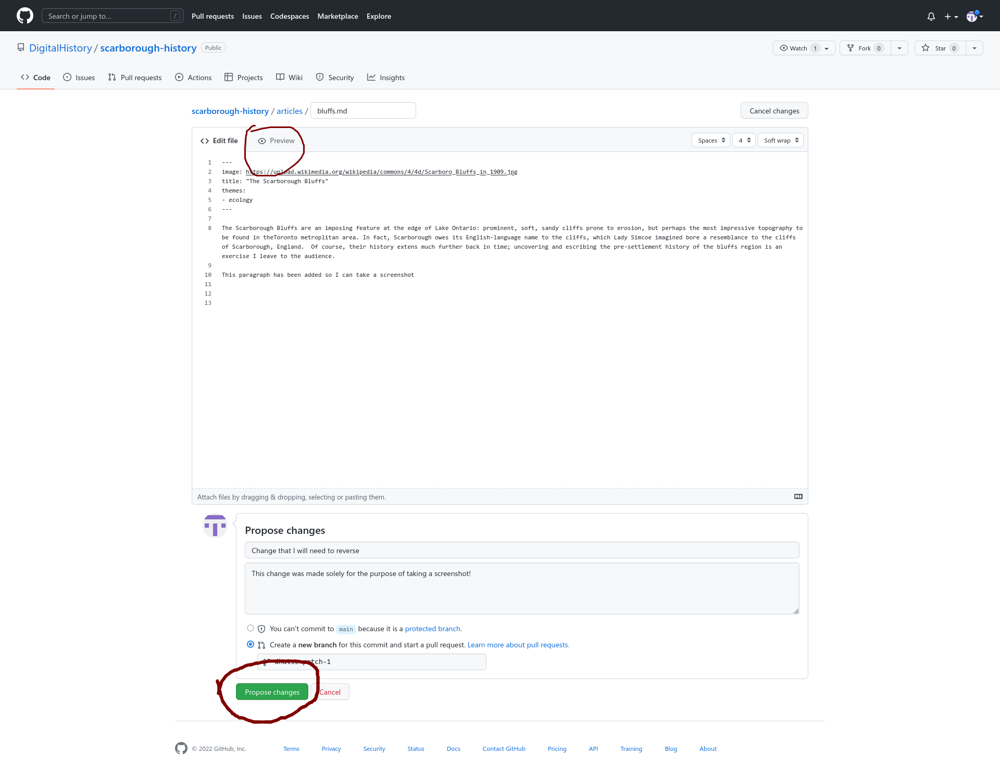
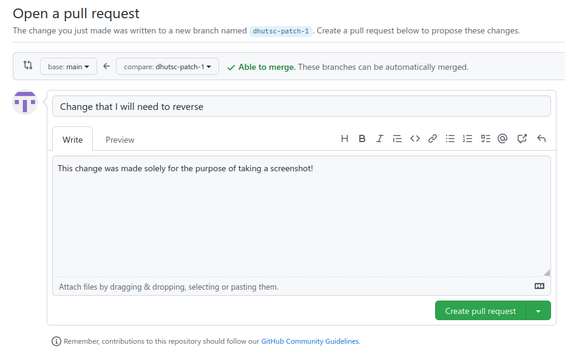

# Source Docs for Scarborough History

## Purpose
This is a highly simplified demonstration project for use in an undergraduate classroom!  Please don't approach it as definitive information... but please *do* enjoy and improve it.  This project was initiated in December 2022 as part of a talk at [UTSC's HSC Department](https://www.utsc.utoronto.ca/hcs/). If you're here for the talk, please read on!

The main purpose of this repository is to give users hands-on experience writing for the web and using ismple data constructs.  It also allows us to think about how one might organize a real history of the district of Scarborough and  its predecessors.

## Instructions

During the demonstration, temporary Github credentials will be provided, but contributors are encouraged to [create their own accounts on Github](https://github.com/join). For today, ignore everything but the [articles](./articles) folder, which you can see in the code view above.  

Each file in this folder is a [Markdown](https://docs.github.com/en/get-started/writing-on-github/getting-started-with-writing-and-formatting-on-github/basic-writing-and-formatting-syntax) document with a "[YAML Header](https://quire.getty.edu/docs-v1/fundamentals/#yaml-basics)}. The YAML Header appears at the beginning of the document, with two dashed lines above and below:

``` markdown
---
title: The Document Title
image: htttps://url.of.an/appropriate/image
subjects: 
- political history
- gender
- etc
periods:
- pre-settlement
- early colonialism
- township
- burough
- district
- postwar
- etc
---

Everything after the dashed line above is markdown content.  Use **bold**, _italics_, and [link syntax](https://www.google.com/search?q=link+syntax) as you wish.  Read the syntax document for more advanced fetures. 

```

Your task is to improve the content found in this folder. You con do this by:

- editing existing content
- creating competely new content

### Edit Existing Files

First, make sure you are logged in to Github! Use the credentials distributed in class, or use your own.

To examine an existing file, navigate to [articles](./articles/) and click on the name of any file. You will see a view a little like this one: 



Notice the pencil icon near the top right.  Clicking on this button will send you to the page editor (see screenshot below). From this view, you can make whatever changes you wish. If you'd like to check your work, click the "Preview" button near the top left.  Your metadata will appear as a table at the top (this can be somewhat confusing). 

**Tip:** try to make all your edits at one time. The next stage can be a little confusing, and it's easy to lose track of your changes while you wait for me to approve them. 

When you're done, click `Propose Changes` at the bototm left.



**Wait!!** There's one more step. You will be taken to a new screen. click the big green `Create Pull Request` button at the bottom of the screen. This will send me a request to approve the change.




### Create New Files

Creating new files is almost identical to editing fies.  As before, navigate to the [articles](./articles) folder.  From here, click the `Add file` button and choose `Create new file`.  From here, just add content to the file, then follow the steps outlined above.  Be sure to `Propose Changes` and `Create Pull Request`!

## Things To Think About

Remember, the topic of today's class is metadata.  I've provided four built-in metadata fields: `title`, `image`, `themes`, and `periods`. Are these good categories for metadata? What about the example terms I've used in the sample content -- are they useful categories? misleading? incomplete? 

How does this kind of project differ from a traditional history paper?  What disadvantages do you see to this kind of writing?

This is a very simple demonstration project. What would be required to turn it into a robust, trustworthy, interesting historical website? 

